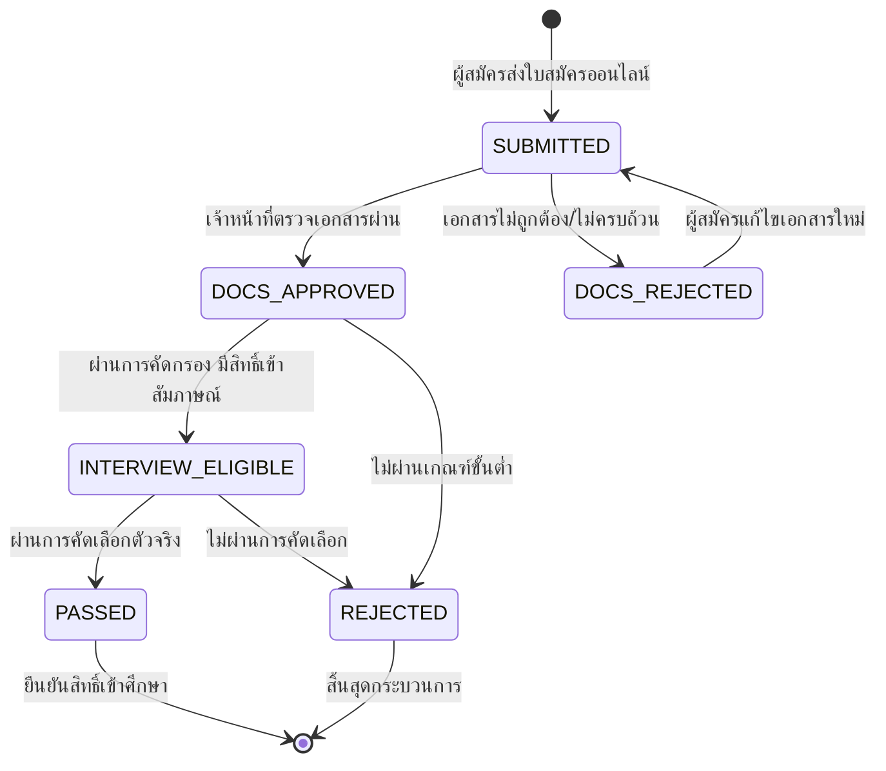

# Technical Architecture & System Flow
## ระบบรับสมัครนิสิตใหม่ (Student Admissions System)

---

### 1. โครงสร้างโฟลเดอร์ของโมดูล (Module Structure)

```
src/features/admissions/
├── index.ts                 # Public Client-safe Types, Enums, Formatters
├── server.ts                # Public Queries สำหรับ Server Components
├── actions.ts               # Public Server Actions (re-export จาก _internal/actions.ts)
├── permissions.ts           # Permission Codes Registry (ADMISSIONS_PERMISSIONS)
├── messages.ts              # พจนานุกรมสองภาษา (TH/EN)
└── _internal/
    ├── actions.ts           # Server Actions (Submit, Review, Score, Export)
    ├── services.ts          # Core Business Logic & Database Queries (Prisma)
    ├── validations.ts       # Zod Schemas (National ID Checksum, Application Form)
    └── validations.test.ts  # Unit Tests
```

---

### 2. แผนผังสถานะใบสมัคร (Application Lifecycle Flow)



---

### 3. Route Mapping

* **Public Portal (ฝั่งผู้สมัคร):**
  * `/admissions`: หน้าหลักรอบรับสมัคร, ปฏิทินกำหนดการ, ค้นหาเกณฑ์ตามหลักสูตร
  * `/admissions/apply`: แบบฟอร์มยื่นใบสมัครออนไลน์ (Step Wizard)
  * `/admissions/tracking`: ระบบค้นหาสถานะใบสมัคร (National ID + Application No.)
  * `/admissions/results`: ประกาศรายชื่อผู้มีสิทธิ์สัมภาษณ์และผลการคัดเลือก
* **Admin Console (ฝั่งคณะ/กรรมการ):**
  * `/admissions/manage/rounds`: จัดการรอบรับสมัคร และกำหนดโควตารายหลักสูตร
  * `/admissions/manage/applications`: ตารางรายชื่อผู้สมัคร, ตัวกรอง, ปุ่มส่งออก Excel
  * `/admissions/manage/review/[id]`: หน้าจอตรวจเอกสารแบบ Split View และบันทึกคะแนน

---

### 4. Permissions Registry

| รหัสสิทธิ์ (Permission Code) | วัตถุประสงค์ |
| :--- | :--- |
| `admissions.round.manage` | สร้าง แก้ไข เปิด/ปิดรอบการรับสมัคร |
| `admissions.application.view` | เข้าดูรายชื่อผู้สมัครและสถิติภาพรวม |
| `admissions.application.review` | ตรวจสอบเอกสาร และบันทึกผลการคัดกรอง |
| `admissions.application.score` | บันทึกคะแนนสัมภาษณ์และตัดสินผลการคัดเลือก |
| `admissions.application.export` | ส่งออกรายชื่อผู้สมัครเป็นไฟล์ Excel |
