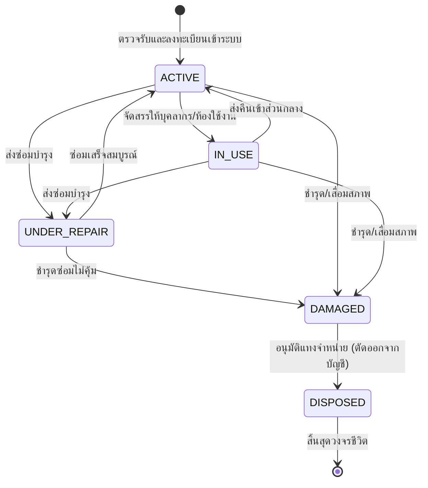

# Technical Architecture & System Flow
## ระบบบริหารจัดการพัสดุและครุภัณฑ์ (Asset & Inventory Management)

---

### 1. โครงสร้างโฟลเดอร์ของโมดูล (Module Structure)

```
src/features/assets/
├── index.ts                 # Public Client-safe Types, Enums, Helpers
├── server.ts                # Public Queries สำหรับ Server Components
├── actions.ts               # Public Server Actions (re-export จาก _internal/actions.ts)
├── permissions.ts           # Permission Codes Registry (ASSETS_PERMISSIONS)
├── messages.ts              # พจนานุกรมสองภาษา (TH/EN)
└── _internal/
    ├── actions.ts           # Server Actions (Create, Transfer, Dispose, Requisition)
    ├── services.ts          # Core Business Logic & Database Queries (Prisma)
    ├── validations.ts       # Zod Schemas
    └── validations.test.ts  # Unit Tests
```

---

### 2. แผนผังสถานะครุภัณฑ์ (Asset Lifecycle State Machine)



---

### 3. Route Mapping

* **Public / Mobile Portal:**
  * `/asset-qr/[id]`: แสดงข้อมูลสรุปของครุภัณฑ์เมื่อสแกน QR Code ติดสติกเกอร์
  * `/inventory/my-assets`: แสดงรายการครุภัณฑ์ที่ตนเองครอบครอง
  * `/inventory/supplies/request`: ยื่นคำขอเบิกวัสดุสิ้นเปลือง
* **Admin Console:**
  * `/inventory/assets`: ทะเบียนครุภัณฑ์, ตัวกรอง, ปุ่มเพิ่ม, ปุ่มพิมพ์ QR Code
  * `/inventory/supplies`: สต็อกวัสดุสิ้นเปลือง, รับเข้า/ตัดจ่าย
  * `/inventory/requisitions`: คิวคำขอเบิกวัสดุรอการอนุมัติ
  * `/inventory/reports`: รายงานสรุปมูลค่าสินทรัพย์ประจำปี

---

### 4. Permissions Registry

| รหัสสิทธิ์ (Permission Code) | วัตถุประสงค์ |
| :--- | :--- |
| `assets.item.view` | ดูรายการและรายละเอียดครุภัณฑ์ |
| `assets.item.manage` | เพิ่ม, แก้ไข, โอนย้าย, ปรับสถานะครุภัณฑ์ |
| `assets.item.dispose` | อนุมัติการแทงจำหน่ายครุภัณฑ์ออกจากบัญชี |
| `assets.supplies.view` | ดูสต็อกวัสดุสิ้นเปลือง |
| `assets.supplies.manage` | จัดการรับเข้า/ตัดจ่ายวัสดุสิ้นเปลือง |
| `assets.requisition.create` | ยื่นคำขอเบิกวัสดุสิ้นเปลือง |
| `assets.requisition.approve` | พิจารณาอนุมัติคำขอเบิกวัสดุสิ้นเปลือง |
