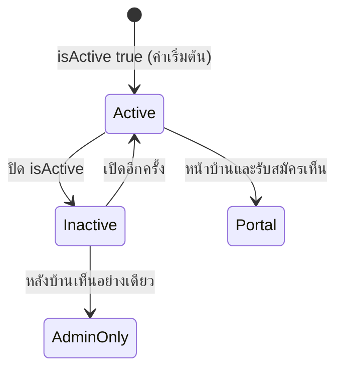
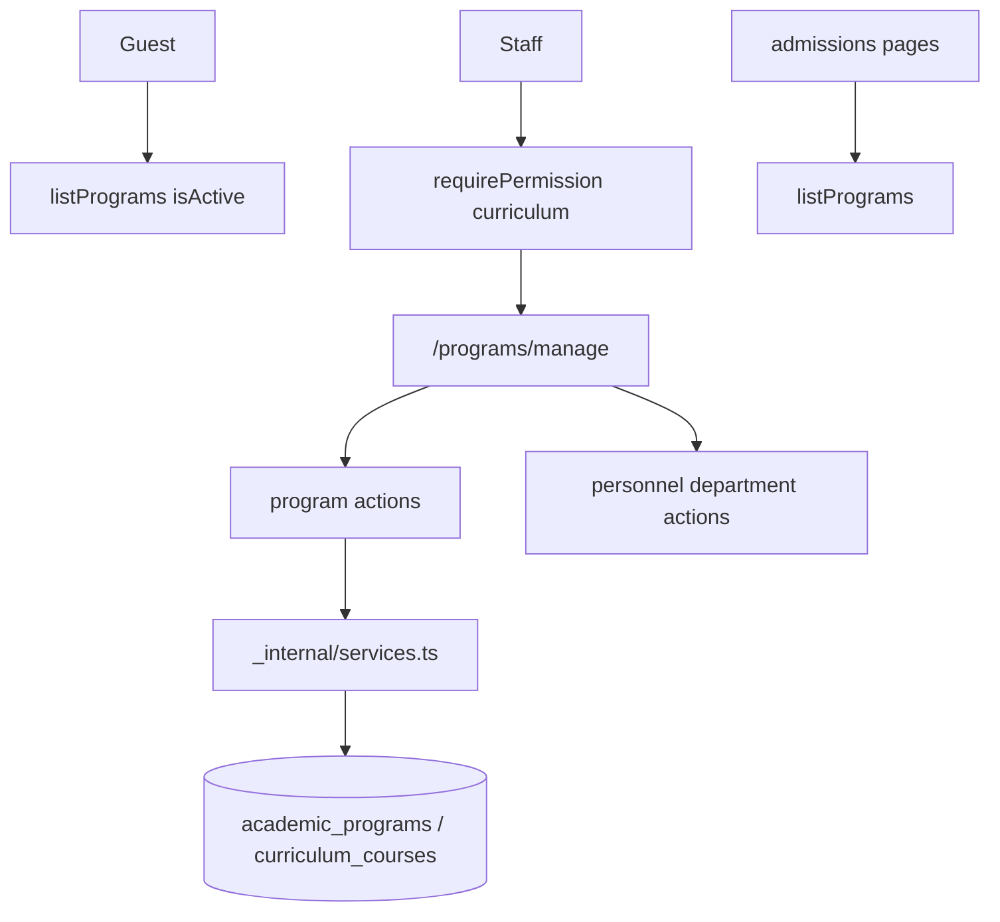

# Technical Architecture & System Flow
## ระบบจัดการหลักสูตร (Academic Programs & Curriculum)

---

### 1. สถาปัตยกรรมระดับโมดูล

```
src/features/curriculum/
├── index.ts
├── server.ts
├── actions.ts
├── permissions.ts
├── messages.ts
└── _internal/
    ├── actions.ts
    ├── services.ts
    ├── validations.ts
    └── validations.test.ts
```

---

### 2. การมองเห็น (ไม่มี published แยก)



`isAcceptingApplications` เป็นธงแสดงผล ไม่ใช่สถานะวงจรชีวิต

---

### 3. ผังเส้นทางหน้าจอ

#### หน้าบ้าน
- `/(portal)/programs` — รายการ active
- `/(portal)/programs/[id]` — รายละเอียด + รายวิชา
- หน้าแรกและ admissions เรียก `listPrograms({ isActive: true })`

#### หลังบ้าน
- `/(admin)/programs/manage` — ต้อง `curriculum:read`
- รวม dialog หลักสูตรและ dialog ภาควิชา

---

### 4. Data Flow



---

### 5. ทะเบียนสิทธิ์

```ts
export const CURRICULUM_P = {
  read: "curriculum:read",
  create: "curriculum:create",
  edit: "curriculum:edit",
  manage: "curriculum:manage",
} as const;
```

ลงทะเบียนใน `src/permissions.ts` ผ่าน `CURRICULUM_PERMISSIONS`
