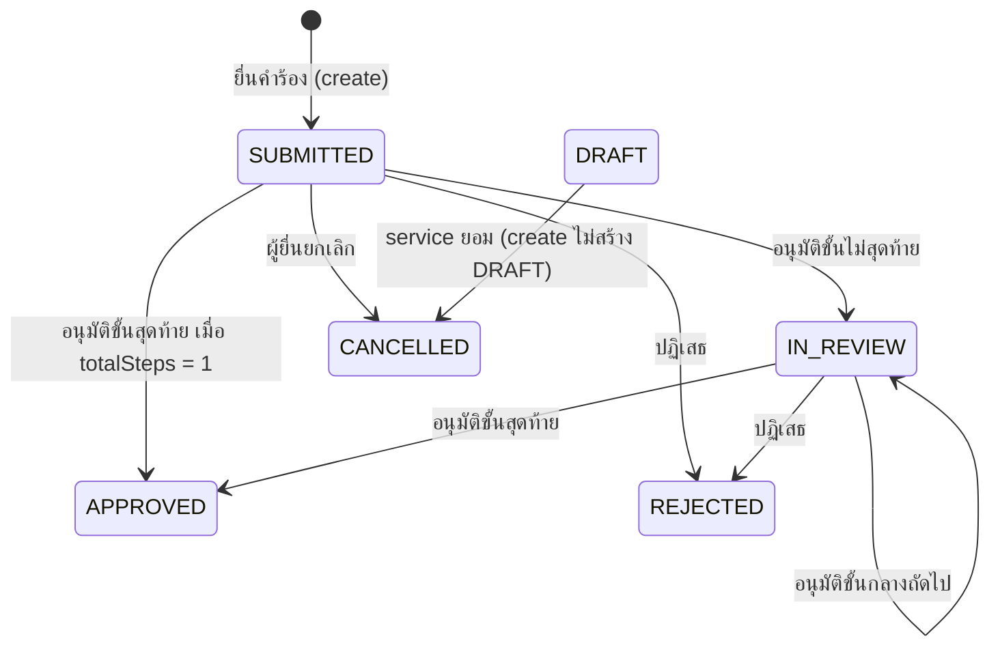
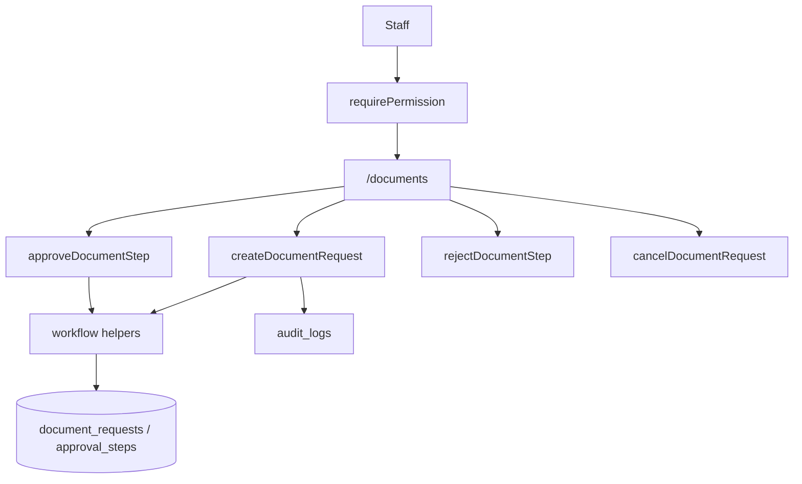

# Technical Architecture & System Flow
## ระบบบริหารจัดการและอนุมัติเอกสาร (E-Documents & Approvals)

---

### 1. สถาปัตยกรรมระดับโมดูล

```
src/features/documents/
├── index.ts
├── server.ts
├── actions.ts
├── permissions.ts
├── messages.ts
└── _internal/
    ├── actions.ts
    ├── services.ts
    ├── validations.ts
    ├── validations.test.ts
    ├── workflow.ts
    └── workflow.test.ts
```

---

### 2. แผนผังสถานะคำร้อง (DocumentStatus)



**กฎจาก `workflow.ts`:**
1. `canReviewDocument` = `SUBMITTED` หรือ `IN_REVIEW`
2. `canCancelDocument` = `SUBMITTED` เท่านั้น
3. `calculateApprovalTransition`: ถ้า `currentStep >= totalSteps` → `APPROVED` + `nextRole = null`; ไม่เช่นนั้น → `IN_REVIEW`, `nextStep + 1`, `nextRole = "DEAN"`

---

### 3. ผังเส้นทางหน้าจอ

#### หลังบ้าน
- `/(admin)/documents` — ต้อง `documents:read`
- `src/app/(admin)/documents/_components/documents-admin-client.tsx`

#### หน้าบ้าน
- ไม่มี route ใต้ `(portal)`

---

### 4. Data Flow



---

### 5. ทะเบียนสิทธิ์

```ts
export const DOCUMENTS_P = {
  read: "documents:read",
  create: "documents:create",
  approve: "documents:approve",
  manage: "documents:manage",
} as const;
```

ลงทะเบียนใน `src/permissions.ts` ผ่าน `DOCUMENTS_PERMISSIONS`
