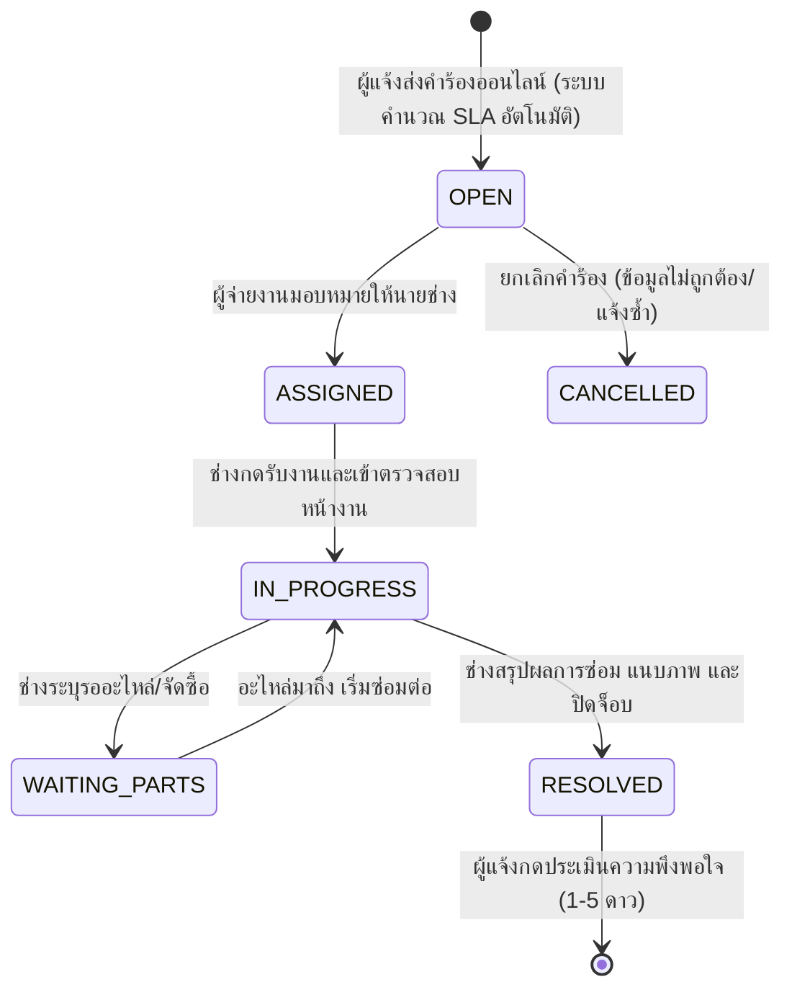

# Technical Architecture & System Flow
## ระบบแจ้งซ่อมและขอใช้บริการออนไลน์ (Maintenance & Service Desk)

---

### 1. โครงสร้างโฟลเดอร์ของโมดูล (Module Structure)

```
src/features/maintenance/
├── index.ts                 # Public Client-safe Types, Enums, Helpers
├── server.ts                # Public Queries สำหรับ Server Components
├── actions.ts               # Public Server Actions (re-export จาก _internal/actions.ts)
├── permissions.ts           # Permission Codes Registry (MAINTENANCE_PERMISSIONS)
├── messages.ts              # พจนานุกรมสองภาษา (TH/EN)
└── _internal/
    ├── actions.ts           # Server Actions (Create, Assign, Progress, Resolve, Rate)
    ├── services.ts          # Core Business Logic & Database Queries (Prisma)
    ├── sla.ts               # ฟังก์ชันคำนวณกำหนดเวลา SLA และเตือน Breach
    ├── validations.ts       # Zod Schemas
    └── validations.test.ts  # Unit Tests
```

---

### 2. แผนผังสถานะใบแจ้งซ่อม (Work Order Lifecycle Flow)



---

### 3. Route Mapping

* **Public & Campus Portal:**
  * `/helpdesk`: แบบฟอร์มแจ้งซ่อมด่วน (Mobile-First UI)
  * `/helpdesk/tracking`: ค้นหาสถานะงานด้วยหมายเลข Ticket
  * `/helpdesk/tickets/[id]`: หน้ารายละเอียดคำร้อง ไทม์ไลน์ และแบบประเมินความพึงพอใจ
* **Admin Console:**
  * `/maintenance/dashboard`: สรุปสถิติ SLA และภาพรวมงานค้าง
  * `/maintenance/kanban`: กระดานจัดการงานซ่อมแบบลากย้ายการ์ด
  * `/maintenance/tickets`: ตารางรายการแจ้งซ่อมทั้งหมดและการจ่ายงาน

---

### 4. Permissions Registry

| รหัสสิทธิ์ (Permission Code) | วัตถุประสงค์ |
| :--- | :--- |
| `maintenance.ticket.create` | ยื่นคำร้องแจ้งซ่อม/บริการ |
| `maintenance.ticket.view` | ดูรายการคำร้องแจ้งซ่อม |
| `maintenance.ticket.manage` | มอบหมายงาน กำหนด Priority และจัดการคิวงาน |
| `maintenance.ticket.resolve` | บันทึกความคืบหน้าการซ่อมและกดปิดงาน |
| `maintenance.category.manage` | ตั้งค่าหมวดหมู่งานบริการและเกณฑ์ SLA |
