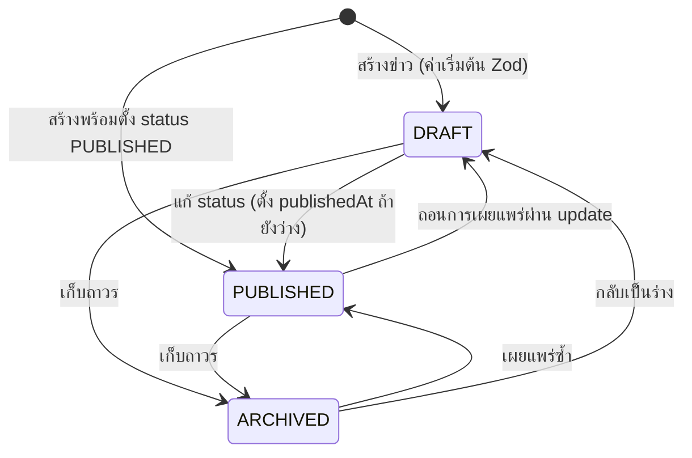
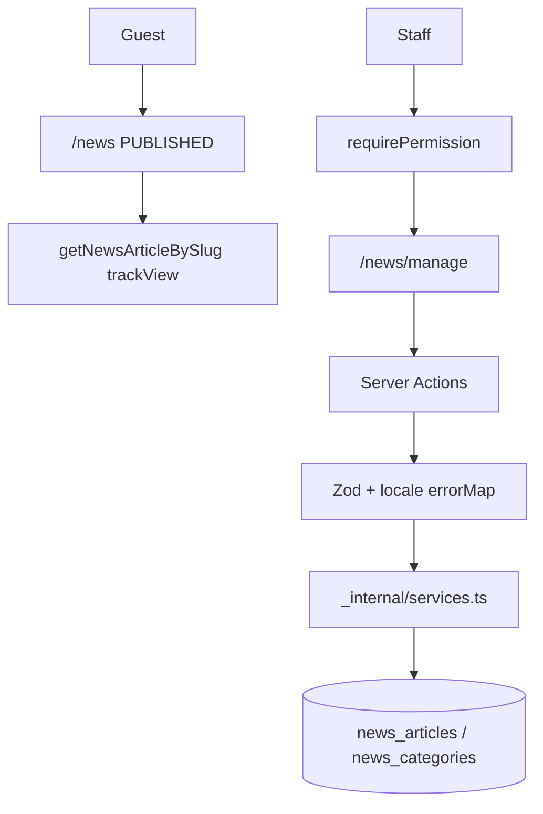

# Technical Architecture & System Flow
## ระบบข่าวสารประชาสัมพันธ์ (News & Announcements)

---

### 1. สถาปัตยกรรมระดับโมดูล

```
src/features/news/
├── index.ts
├── server.ts
├── actions.ts
├── permissions.ts
├── messages.ts
└── _internal/
    ├── actions.ts
    ├── services.ts
    ├── validations.ts
    └── validations.test.ts
```

---

### 2. แผนผังสถานะข่าว (NewsStatus)



**กฎที่โค้ดทำจริง:** ไม่มี state machine บังคับทิศทาง — create/update ตั้ง `status` เป็นค่าใดก็ได้ใน enum

**การมองเห็น:**

| สถานะ | Admin | Portal list/detail | viewCount |
| :--- | :---: | :---: | :---: |
| DRAFT | เห็น | ไม่เห็น / 404 | ไม่นับ |
| PUBLISHED | เห็น | เห็น | นับเมื่อเปิดรายละเอียด |
| ARCHIVED | เห็น | ไม่เห็น / 404 | ไม่นับ |

---

### 3. ผังเส้นทางหน้าจอ (Route Mapping)

#### หน้าบ้าน (Public Portal)
- `src/app/(portal)/news/page.tsx` — รายการข่าว PUBLISHED
- `src/app/(portal)/news/[slug]/page.tsx` — รายละเอียด + related
- `src/app/(portal)/page.tsx` — วิดเจ็ตข่าวล่าสุด 3 รายการ
- `src/app/(portal)/news/_components/public-news-client.tsx`

`proxy.ts` เปิด `/news` สาธารณะ ยกเว้น path ที่มี `/manage`

#### หลังบ้าน (Admin Console)
- `src/app/(admin)/news/manage/page.tsx` — ต้อง `news:read`
- `src/app/(admin)/news/_components/news-admin-client.tsx`

---

### 4. Data Flow



---

### 5. ทะเบียนสิทธิ์

ประกาศใน `src/features/news/permissions.ts` ลงทะเบียนใน `src/permissions.ts`:

```ts
export const NEWS_P = {
  read: "news:read",
  create: "news:create",
  edit: "news:edit",
  publish: "news:publish",
  manage: "news:manage",
} as const;
```

| Action | สิทธิ์ที่ใช้จริง |
| :--- | :--- |
| เปิด `/news/manage` | `news:read` |
| `createArticleAction` | `news:create` |
| `updateArticleAction` | `news:edit` |
| `deleteArticleAction` | `news:manage` |
| `createNewsCategoryAction` / `updateNewsCategoryAction` | `news:manage` |
