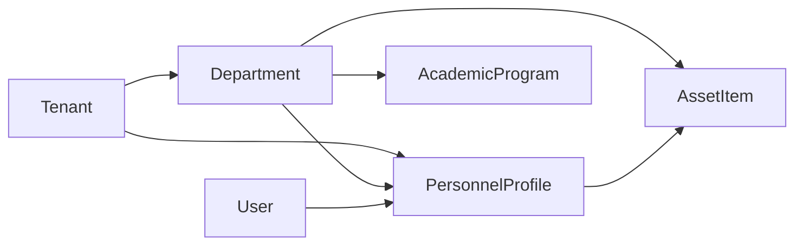
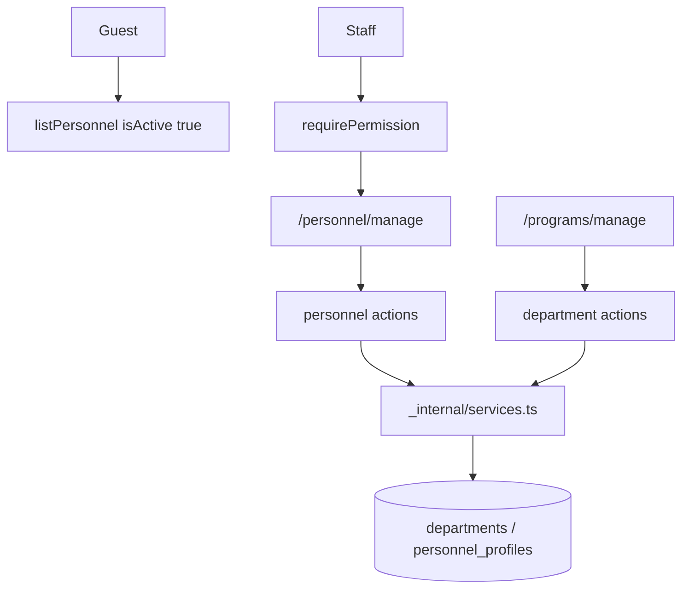

# Technical Architecture & System Flow
## ระบบจัดการบุคลากร (Personnel Directory)

---

### 1. สถาปัตยกรรมระดับโมดูล

```
src/features/personnel/
├── index.ts
├── server.ts
├── actions.ts
├── permissions.ts
├── messages.ts
└── _internal/
    ├── actions.ts
    ├── services.ts
    ├── validations.ts
    └── validations.test.ts
```

---

### 2. ความสัมพันธ์โดเมน



ไม่มี state machine ของโปรไฟล์ — การมองเห็นควบคุมด้วย `isActive`

---

### 3. ผังเส้นทางหน้าจอ

#### หน้าบ้าน
- `/(portal)/personnel` — รายการ active
- `/(portal)/personnel/[id]` — รายละเอียด; 404 ถ้าปิดใช้งาน
- `src/app/(portal)/personnel/_components/public-personnel-client.tsx`

#### หลังบ้าน
- `/(admin)/personnel/manage` — ต้อง `personnel:read`
- `src/app/(admin)/personnel/_components/personnel-admin-client.tsx`
- แก้/ลบภาควิชาอยู่ที่ `/(admin)/programs/manage`

---

### 4. Data Flow



---

### 5. ทะเบียนสิทธิ์

```ts
export const PERSONNEL_P = {
  read: "personnel:read",
  create: "personnel:create",
  edit: "personnel:edit",
  manage: "personnel:manage",
} as const;
```

ลงทะเบียนใน `src/permissions.ts` ผ่าน `PERSONNEL_PERMISSIONS`
