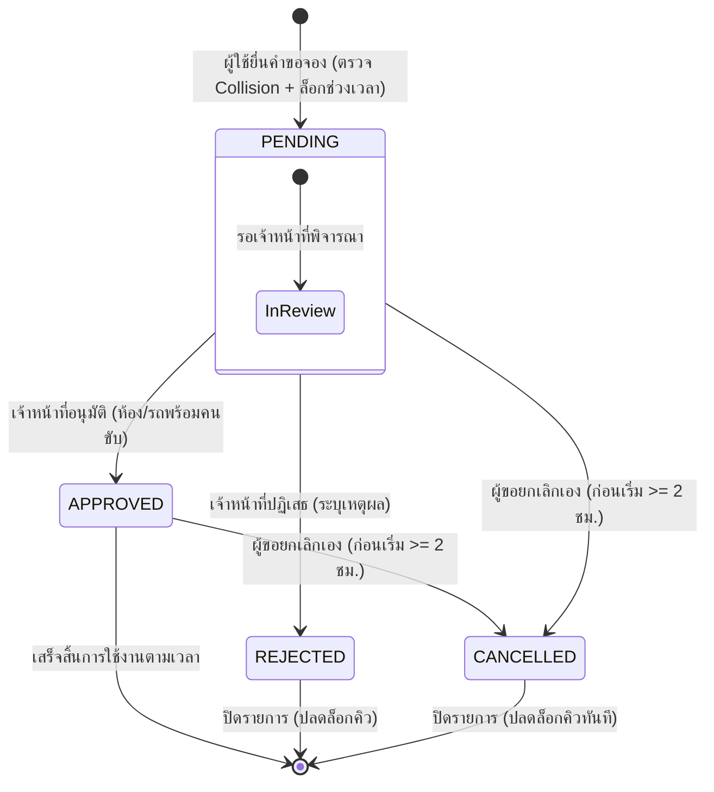

# Technical Architecture & System Flow
## ระบบจองห้องประชุมและยานพาหนะ (Facility & Fleet Reservation)

---

### 1. สถาปัตยกรรมระดับโมดูล (Modular Structure)

โครงสร้างโฟลเดอร์ของฟีเจอร์ภายใต้ `src/features/reservations/` เป็นไปตามมาตรฐาน Modular Monolith ของ VibeCore:

```
src/features/reservations/
├── index.ts                 # Public Client-safe Types, Enums, Helpers
├── server.ts                # Public Server Functions (สำหรับ Server Components และ Cross-feature)
├── actions.ts               # Public Server Actions (re-export จาก _internal/actions.ts)
├── permissions.ts           # Permission Codes Registry (RESERVATIONS_P)
├── messages.ts              # พจนานุกรมข้อความสองภาษา (TH/EN)
└── _internal/
    ├── actions.ts           # Server Action Handlers (รับ input, validate, เรียก services)
    ├── services.ts          # Core Business Logic & Database Queries (Prisma)
    ├── collision.ts         # อัลกอริทึมตรวจสอบช่วงเวลาทับซ้อนและ Buffer 30 นาที
    ├── validations.ts       # Zod Schemas สำหรับ Create, Approve, Reject, Cancel
    └── validations.test.ts  # Unit Tests สำหรับ Zod Schemas และ Collision Logic
```

---

### 2. แผนผังสถานะคำขอจอง (State Machine & Lifecycle Flow)

สถานะของคำขอจอง (`ReservationStatus`) ประกอบด้วย 4 สถานะหลัก:



**กฎการเปลี่ยนสถานะ (State Transition Rules):**
1. **PENDING → APPROVED:** เฉพาะผู้มีสิทธิ์ `reservations:approve` เท่านั้น และหากเป็นยานพาหนะ ต้องระบุคนขับรถ
2. **PENDING → REJECTED:** เฉพาะผู้มีสิทธิ์ `reservations:approve` เท่านั้น ต้องมี `rejectionReason`
3. **PENDING / APPROVED → CANCELLED:** ผู้ขอจองเป็นผู้ยกเลิกได้ โดย `now() <= startTime - 2 hours`

---

### 3. อัลกอริทึมป้องกันเวลาทับซ้อน (Collision Prevention Algorithm)

การจองใดๆ จะต้องไม่ทับซ้อนกับรายการจองที่มีอยู่แล้วซึ่งมีสถานะ `PENDING` หรือ `APPROVED` และต้องไม่ทับซ้อนกับช่วงเวลาปิดปรับปรุง (`ResourceBlackout`)

**สูตรการตรวจสอบช่วงเวลาทับซ้อนพร้อม Buffer 30 นาที:**

กำหนดให้:
- ช่วงเวลาที่ต้องการจอง: $[S_{new}, E_{new}]$
- ช่วงเวลาที่มีอยู่เดิม: $[S_{exist}, E_{exist}]$
- ระยะเวลาเผื่อความพร้อม: $B = 30 \text{ minutes}$

ช่วงเวลาของคำขอเดิมที่ครอบคลุม Buffer คือ $[S_{exist} - B, E_{exist} + B]$

เงื่อนไขการเกิด Collision (ทับซ้อน):
$$\text{Collision} = (S_{new} < E_{exist} + B) \land (E_{new} > S_{exist} - B)$$

**Prisma Query Implementation:**
```ts
const BUFFER_MINUTES = 30;
const bufferMs = BUFFER_MINUTES * 60 * 1000;

const bufferedStart = new Date(newStart.getTime() - bufferMs);
const bufferedEnd = new Date(newEnd.getTime() + bufferMs);

const conflictingBookings = await db.reservation.findMany({
  where: {
    tenantId,
    resourceId,
    status: { in: ["PENDING", "APPROVED"] },
    id: excludeId ? { not: excludeId } : undefined,
    AND: [
      { startTime: { lt: bufferedEnd } },
      { endTime: { gt: bufferedStart } },
    ],
  },
});
```

---

### 4. ผังเส้นทางหน้าจอ (Route Mapping & Dual-view Layouts)

#### 4.1 ฝั่งหน้าบ้าน (Public Portal)
- **Layout:** `src/app/(portal)/layout.tsx` (Portal Header + Footer)
- **เส้นทาง:**
  - `/(portal)/facilities` — แสดงแคตตาล็อกห้องประชุมและรถยนต์ พร้อมปุ่มเลือกดูตารางงาน
  - `/(portal)/facilities/schedule` — ปฏิทินแสดงตารางการใช้งานประจำวัน (Schedule Board ซ่อนข้อมูลส่วนบุคคล)
  - `/(portal)/facilities/[id]` — หน้ารายละเอียดสเปกห้อง/รถ สิ่งอำนวยความสะดวก และปุ่ม "เข้าสู่ระบบเพื่อจอง"

#### 4.2 ฝั่งหลังบ้าน (Admin Console)
- **Layout:** `src/app/(admin)/layout.tsx` (Liyon Admin Sidebar + Navbar)
- **เส้นทาง:**
  - `/(admin)/reservations/calendar` — ปฏิทินจองห้อง/รถ แบบโต้ตอบ (คลิกช่วงเวลาว่างเพื่อเปิด Dialog จอง)
  - `/(admin)/reservations/my` — รายการคำขอจองของฉัน (ตารางติดตามสถานะ, ปุ่มกดยกเลิก)
  - `/(admin)/reservations/inbox` — คิวงานรออนุมัติสำหรับเจ้าหน้าที่อาคารและยานพาหนะ (ปุ่ม Approve / Reject Modal)
  - `/(admin)/reservations/resources` — หน้าจัดการทรัพยากร (เพิ่ม/แก้ไขห้อง, รถยนต์, กำหนดช่วงเวลาปิดปรับปรุง)

---

### 5. ทะเบียนสิทธิ์ (Permission Codes Registry)

ประกาศใน `src/features/reservations/permissions.ts` และนำไปลงทะเบียนใน `src/permissions.ts`:

```ts
export const RESERVATIONS_P = {
  read: "reservations:read",         // ดูรายการจองและปฏิทินภายใน
  create: "reservations:create",     // สร้างคำขอจองห้อง/รถ
  cancel: "reservations:cancel",     // ยกเลิกคำขอของตนเอง
  approve: "reservations:approve",   // อนุมัติ/ปฏิเสธคำขอ (เจ้าหน้าที่)
  manage: "reservations:manage",     // จัดการห้อง ยานพาหนะ และ Blackouts (Admin)
} as const;
```

**การแมปบทบาทตั้งต้น (Role Mapping):**
- `VIEWER`: ได้รับ `reservations:read`
- `STAFF` / `FACULTY`: ได้รับ `reservations:read`, `reservations:create`, `reservations:cancel`
- `FACILITY_OFFICER` / `FLEET_OFFICER`: ได้รับสิทธิ์เพิ่ม `reservations:approve`
- `SUPER_ADMIN`: ได้รับทุกสิทธิ์โดยอัตโนมัติ
